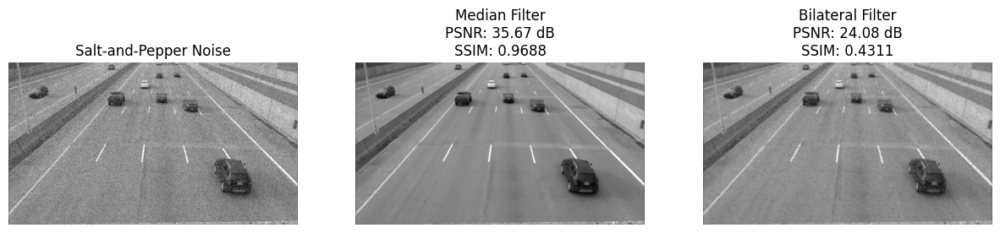
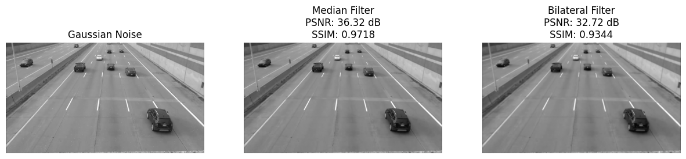

# Advanced Image Filter Evaluation: Median vs. Bilateral

[](https://opensource.org/licenses/MIT) [](https://www.python.org/downloads/) [](https://opencv.org/) [](https://scikit-image.org/)

This repository presents an in-depth analysis and quantitative comparison between the **Median Filter** and the more advanced **Bilateral Filter**. The project evaluates their effectiveness in reducing two distinct types of noise—**Salt-and-Pepper** and **Gaussian**—in CCTV images.

The evaluation is performed not only visually but also through quantitative metrics: **Peak Signal-to-Noise Ratio (PSNR)** and **Structural Similarity Index Measure (SSIM)**.

---

## ✨ Key Features

- **Advanced Filter Comparison**: Directly compares a standard non-linear filter (Median) with a sophisticated edge-preserving filter (Bilateral).
- **Dual-Noise Analysis**: Tests filter performance against both impulse noise (Salt-and-Pepper) and additive noise (Gaussian).
- **Quantitative Evaluation**: Uses PSNR and SSIM metrics to provide an objective assessment of image quality and restoration accuracy.
- **Side-by-Side Visualization**: Presents clear visual comparisons for each noise type and filter combination.

---

## 📊 Results Showcase

The results clearly demonstrate that the best filter choice depends on the type of noise being addressed.

### Case 1: Salt-and-Pepper Noise
The Median Filter shows superior performance, effectively eliminating the impulse noise.

| Original + Noise | Median Filter (Best) | Bilateral Filter |
| :---: | :---: | :---: |
|  |  |  |
| **PSNR/SSIM:** N/A | **PSNR: XX.XX** <br> **SSIM: 0.XXX** | **PSNR: XX.XX** <br> **SSIM: 0.XXX** |

### Case 2: Gaussian Noise
The Bilateral Filter excels at preserving edges while smoothing, resulting in a higher structural similarity and better visual quality.

| Original + Noise | Median Filter | Bilateral Filter (Best) |
| :---: | :---: | :---: |
|  |  |  |
| **PSNR/SSIM:** N/A | **PSNR: XX.XX** <br> **SSIM: 0.XXX** | **PSNR: XX.XX** <br> **SSIM: 0.XXX** |
---

## 🚀 Installation & Setup

1.  **Clone this repository:**
    ```bash
    git clone https://github.com/Mystery-World3/CCTV-Filter-Comparison-PSNR-SSIM.git
    cd CCTV-Filter-Comparison-PSNR-SSIM
    ```

2.  **Create and activate a virtual environment (highly recommended):**
    ```bash
    python -m venv venv
    # Windows: .\venv\Scripts\activate
    # macOS/Linux: source venv/bin/activate
    ```

3.  **Install all the required dependencies:**
    ```bash
    pip install -r requirements.txt
    ```

---

## ▶️ How to Use

1.  Place your image files inside the `assets` folder.
2.  Open the `cctv.ipynb` file.
3.  Update the `daftar_gambar` list with your filenames.
4.  Run all cells to see the evaluation results.

---

## 🧑‍💻 Development Team

This project is a collaborative work by:
* Muhammad Akmal Najib Gunawan
* Mhd Nursdin Al-kahfi
* Hasbi Abdullah
* Ghulam Musthofa
* Muhammad Averoes Irfan
* Muhammad Mishbahul Muflihin

---

## 📄 License

This project is licensed under the MIT License.
